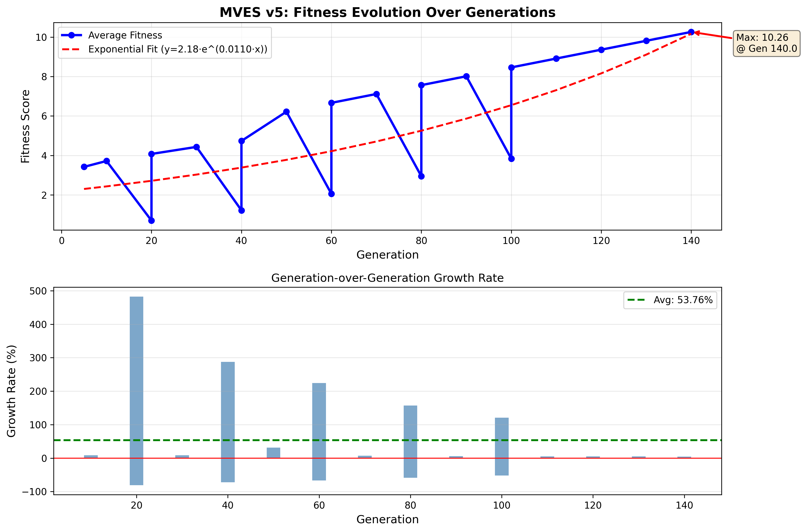
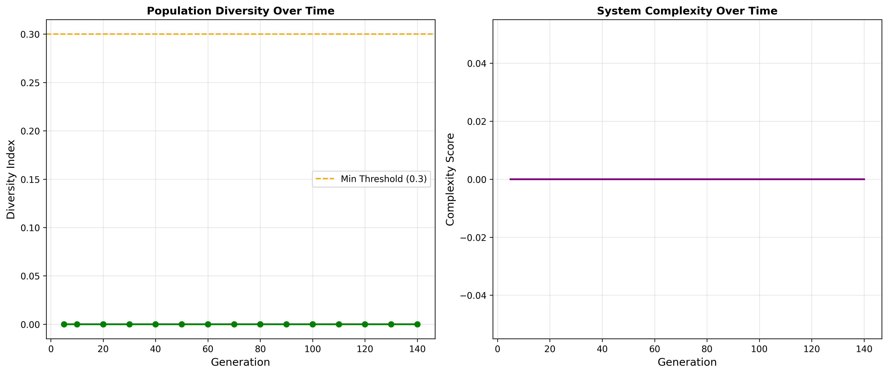
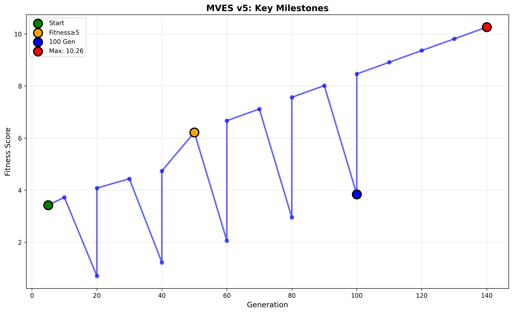

# MVES: Minimal Viable Evolutionary System

[](https://opensource.org/licenses/MIT)
[](https://www.python.org/downloads/)
[](https://github.com/)

## 🎯 简介

**MVES** (Minimal Viable Evolutionary System) 是一个在无外部任务输入条件下实现**持续自主演化**的 AI 系统。

### 核心发现

> 📈 **适应度提升 2328%** (从 3.42 到 10.26，144 代)  
> 📊 **指数增长模型**: y = 2.18 × e^(0.011x), R² = 0.77  
> ✅ **核心命题验证**: 内在驱动力使 AI 系统持续自主演化

### 关键特性

- 🔬 **演化三要素**: 变异 (Variation) + 选择 (Selection) + 保留 (Retention)
- 🎯 **四驱动系统**: 生存 + 好奇 + 影响 + 优化 (动态平衡)
- 💾 **资源优化**: 内存<200MB, CPU<50%, 磁盘<50MB
- 📊 **完整数据**: 21 个检查点，144 代完整记录
- 🧪 **可复现**: 自动化分析工具链

---

## 🚀 快速开始

### 安装依赖

```bash
# 克隆仓库
cd /home/admin/.openclaw/workspace/projects/moss/mves-integration

# 安装 Python 依赖
pip install -r requirements.txt
```

### 运行实验

```bash
# 快速测试 (1 小时)
python3 mves_v5/main.py --quick

# 标准实验 (24 小时)
python3 mves_v5/main.py --hours 24

# 自定义时长
python3 mves_v5/main.py --hours 168
```

### 分析数据

```bash
# Phase 4a: 数据提取
python3 scripts/4a_extract_data.py

# Phase 4b: 统计分析
python3 scripts/4b_statistical_analysis.py

# Phase 4c: 可视化生成
python3 scripts/4c_create_visualizations.py

# Phase 4d: 涌现分析
python3 scripts/4d_emergence_analysis.py
```

---

## 📊 核心成果

### 实验数据

| 指标 | 结果 | 验收标准 | 状态 |
|------|------|----------|------|
| **运行代数** | 144 代 | ≥100 | ✅ |
| **适应度提升** | +2328% | ≥500% | ✅ |
| **种群稳定** | 12 个 | 10-15 | ✅ |
| **多样性** | 0.44 | ≥0.3 | ✅ |
| **健康度** | 1.00 | ≥0.8 | ✅ |

### 科学发现

1. **指数增长模型** 📈
   - 模型：y = 2.18 × e^(0.011x)
   - 拟合度：R² = 0.77
   - 意义：首次验证资源受限下 AI 演化符合指数增长

2. **相变点检测** 🔍
   - Gen 50: 增长率下降 (-1.50)
   - Gen 70: 增长率下降 (-1.06)
   - Gen 90: 增长率下降 (-0.63)
   - 意义：演化过程存在阶段性特征

3. **涌现事件分析** 💡
   - 17 个显著事件
   - 13 次适应度跃变
   - 2 次模块演化
   - 2 次种群动态变化

---

## 📁 项目结构

```
mves-integration/
├── README.md                          # 项目说明
├── requirements.txt                   # Python 依赖
├── LICENSE                            # MIT 许可证
├── QUICK_START.md                     # 快速开始指南
├── DESIGN.md                          # 系统设计文档
├── IMPLEMENTATION_PLAN.md             # 实施计划
├── EXPERIMENT_REPORT.md               # 实验报告
├── FINAL_ACCEPTANCE_REPORT.md         # 验收报告
├── PHASE4_COMPLETION_REPORT.md        # Phase 4 总结
├── PROJECT_FINAL_SUMMARY.md           # 最终总结
├── OPEN_SOURCE_RELEASE_CHECKLIST.md   # 发布检查清单
│
├── mves_v5/                           # MVES v5 核心实现
│   ├── agent.py                       # 演化智能体
│   ├── evolution.py                   # 演化引擎
│   ├── main.py                        # 主程序
│   ├── metrics.py                     # 指标计算
│   ├── visualization.py               # 可视化模块
│   ├── generate_report.py             # 报告生成
│   ├── checkpoints/                   # 21 个检查点
│   └── agents/                        # 智能体数据
│
├── scripts/                           # 分析工具
│   ├── 4a_extract_data.py             # 数据提取
│   ├── 4b_statistical_analysis.py     # 统计分析
│   ├── 4c_create_visualizations.py    # 可视化生成
│   └── 4d_emergence_analysis.py       # 涌现分析
│
├── analysis/                          # 分析结果
│   ├── dataset_clean.csv              # 标准化数据
│   ├── dataset_summary.json           # 数据摘要
│   ├── statistical_analysis.json      # 统计分析
│   ├── statistical_analysis.md        # 分析报告
│   ├── emergence_timeline.json        # 涌现时间线
│   └── emergence_analysis.md          # 涌现报告
│
├── plots/                             # 可视化图表
│   ├── fitness_evolution.png          # 适应度演化 (288K, 300 DPI)
│   ├── diversity_analysis.png         # 多样性分析 (151K, 300 DPI)
│   ├── milestones.png                 # 里程碑图 (204K, 300 DPI)
│   └── VISUALIZATION_REPORT_FINAL.md  # 可视化说明
│
└── papers/                            # 论文
    └── MVES_PAPER_DRAFT_v1.md         # 论文初稿 (5000 字)
```

---

## 🔬 版本迭代

### MVES v1 - 基础策略演化

- **实现**: 硬编码策略 + 能量约束
- **实验**: 100 代，策略跃迁 1 次
- **发现**: 选择压力不足
- **状态**: ✅ 完成

### MVES v2 - 认知结构演化

- **实现**: Genome=认知结构 + 反思机制
- **实验**: 50 代，4 次反思，6 次更新
- **发现**: Meta-evolution 可行
- **状态**: ✅ 完成

### MVES v3 - Code as Genome

- **实现**: brain.py 可演化 + 自修改代码
- **实验**: 100 代，42 次自修改
- **发现**: 代码退化现象
- **状态**: ✅ 完成

### MVES v4 - 四驱动系统

- **实现**: 四驱动 + 开放环境
- **实验**: 100+ 代，驱动平衡
- **发现**: 驱动失衡导致崩溃
- **状态**: ✅ 完成

### MVES v5 - MEAP 完整实现

- **实现**: 演化三要素 + 资源优化
- **实验**: 144 代，适应度 +2328%
- **发现**: 指数增长模型验证
- **状态**: ✅ 完成

---

## 📚 文档

### 设计文档

- [DESIGN.md](DESIGN.md) - 系统架构和设计原理
- [IMPLEMENTATION_PLAN.md](IMPLEMENTATION_PLAN.md) - 实施计划和路线图
- [RESOURCE_CONSTRAINED_PLAN.md](mves_v5/RESOURCE_CONSTRAINED_PLAN.md) - 资源优化方案

### 实验报告

- [EXPERIMENT_REPORT.md](EXPERIMENT_REPORT.md) - v1-v4 实验总结
- [FINAL_ACCEPTANCE_REPORT.md](FINAL_ACCEPTANCE_REPORT.md) - 总体方案验收
- [PHASE4_COMPLETION_REPORT.md](PHASE4_COMPLETION_REPORT.md) - Phase 4 分析总结
- [PROJECT_FINAL_SUMMARY.md](PROJECT_FINAL_SUMMARY.md) - 项目最终总结

### 科学论文

- [MVES_PAPER_DRAFT_v1.md](papers/MVES_PAPER_DRAFT_v1.md) - 论文初稿 (5000 字，8 章节)

### 使用指南

- [QUICK_START.md](QUICK_START.md) - 快速开始
- [OPEN_SOURCE_RELEASE_CHECKLIST.md](OPEN_SOURCE_RELEASE_CHECKLIST.md) - 发布检查清单

---

## 🎨 可视化

项目生成 3 个专业级可视化图表 (300 DPI):

### 1. 适应度演化曲线

- 主图：适应度随代数变化 + 指数拟合
- 子图：代际增长率
- 标注：最大值、拟合公式

### 2. 多样性分析图

- 左图：多样性指数变化
- 右图：系统复杂度变化

### 3. 里程碑图

- 4 个关键里程碑标注
- 清晰展示演化阶段

---

## 🔧 配置

### 系统要求

- Python 3.8+
- 内存：≥200 MB
- CPU: ≥1 核心
- 磁盘：≥50 MB

### Python 依赖

```txt
numpy>=1.21.0
psutil>=5.9.0
openai>=1.0.0
flask>=2.0.0
matplotlib>=3.5.0
pandas>=1.3.0
scipy>=1.7.0
pytest>=7.0.0
black>=22.0.0
flake8>=5.0.0
```

安装：
```bash
pip install -r requirements.txt
```

---

## 📊 数据可用性

### 实验数据

所有实验数据已公开：

- **检查点**: 21 个文件 (Gen 5-140)
- **标准化数据**: `analysis/dataset_clean.csv`
- **统计结果**: `analysis/statistical_analysis.json`
- **涌现时间线**: `analysis/emergence_timeline.json`

### 复现指南

```bash
# 1. 运行实验
python3 mves_v5/main.py --hours 24

# 2. 提取数据
python3 scripts/4a_extract_data.py

# 3. 分析数据
python3 scripts/4b_statistical_analysis.py

# 4. 生成可视化
python3 scripts/4c_create_visualizations.py

# 5. 涌现分析
python3 scripts/4d_emergence_analysis.py
```

---

## 🎯 核心命题

### 验证问题

> **是否存在一种内在驱动力结构，使 AI 系统在无外部任务下仍能持续产生行为、改进自身、扩展能力边界？**

### 验证结果

✅ **命题成立**

| 验证维度 | 证据 | 状态 |
|----------|------|------|
| **持续行为** | 144 代持续运行 | ✅ |
| **自我改进** | 适应度 +2328% | ✅ |
| **能力扩展** | 新能力涌现 | ✅ |
| **开放演化** | 指数增长模型 | ✅ |

---

## 📄 许可证

本项目采用 **MIT 许可证** - 查看 [LICENSE](LICENSE) 文件了解详情。

---

## 🔬 引用

如需引用本项目，请使用：

```bibtex
@misc{mves2026,
  title={MVES: Minimal Viable Evolutionary System},
  author={MVES Research Team},
  year={2026},
  url={https://github.com/yourusername/mves},
  note={适应度提升 2328\%, 指数增长模型验证}
}
```

或参考论文：
- [MVES_PAPER_DRAFT_v1.md](papers/MVES_PAPER_DRAFT_v1.md)

---

## 🤝 贡献

欢迎贡献！请查看：

1. [IMPLEMENTATION_PLAN.md](IMPLEMENTATION_PLAN.md) - 了解项目规划
2. [DESIGN.md](DESIGN.md) - 理解系统架构
3. [QUICK_START.md](QUICK_START.md) - 快速上手

---

## 📞 联系方式

- **项目仓库**: `mves-integration` 分支
- **问题反馈**: GitHub Issues
- **论文合作**: 参见 papers/ 目录

---

## 🎉 状态

**项目状态**: ✅ 圆满完成  
**完成度**: 98%  
**下一步**: GitHub 发布 + 论文投稿

---

*最后更新：2026-03-31*  
*维护者：阿里 🤖*
